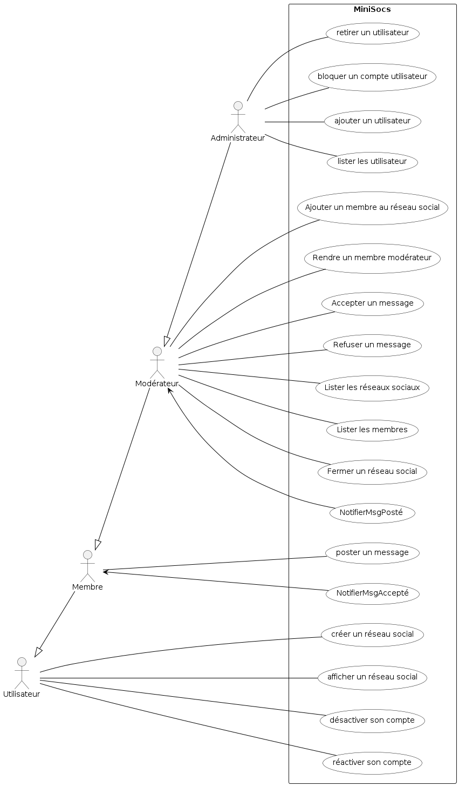
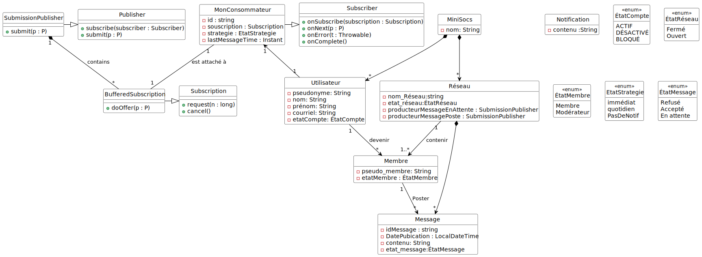
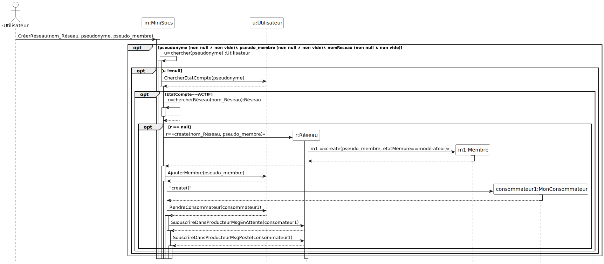
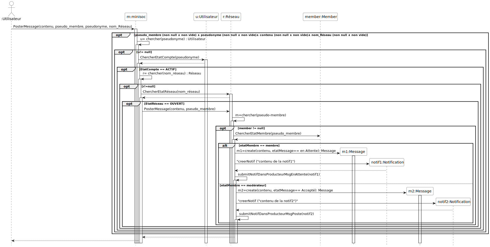
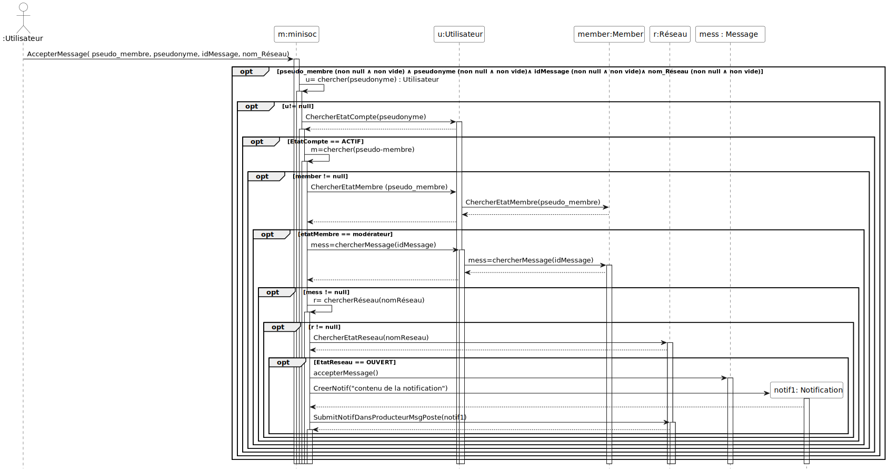
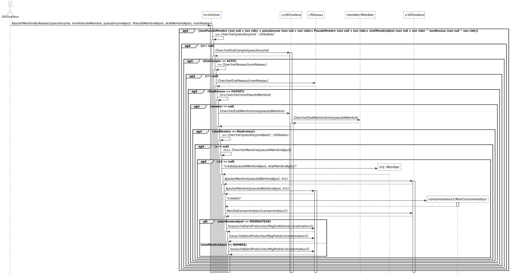
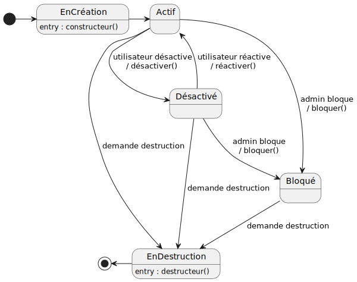
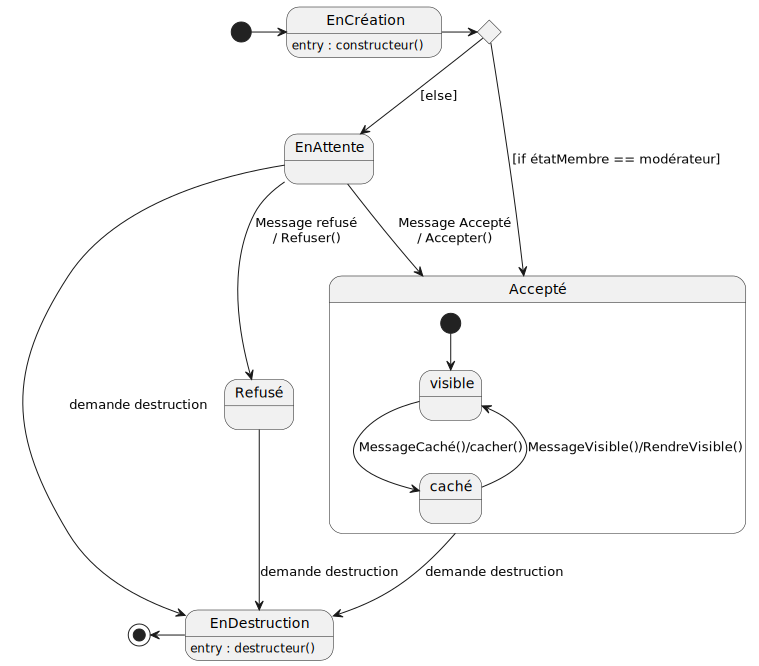

# Gestion de mini réseaux sociaux MiniSocs

Collaborateurs :
* Yakine KLABI
* Sarra KOSSENTINI

## Introduction

Ce logiciel de gestion de mini réseaux sociaux est un projet académique visant à apprendre la spécification logicielle, la conception UML, le développement en java ainsi que la programmation de tests unitaires et de validation. 

## Syntaxe MarkDown

La syntaxe MarkDown de ce document est compatible avec la syntaxe
GitLab, qui est documentée dans
https://docs.gitlab.com/ee/user/markdown.html

## Description du logiciel

Le système contient une façade nommée "MiniSocs" qui permet aux acteurs d'interagir avec le système.
Un administrateur du système peut ajouter, lister, et retirer des utilisateurs. 
Un utilisateur peut créer un réseau social, avec de plano le droit de modérer ce nouveau réseau social. La fonction de modération consiste, premièrement, en l’ajout d’un membre au réseau social, deuxièmement, en la promotion d’un membre du réseau social à la fonction de modération, et troisièmement, en l’approbation des messages postés avant qu’ils soient visibles aux membres du réseau social.
Les utilisateurs du système participent potentiellement à beaucoup de réseaux sociaux et peuvent finement configurer leurs participations. En plus d’un nom, d’un prénom et d’une adresse courriel, un utilisateur possède un pseudonyme pour le système, puis un pseudonyme différent pour chacune de ses participations (à des réseaux sociaux différents) nommé pseudoMembre. 

Le processus de modération a priori des messages est le suivant : (1) le message est posté dans le réseau social par un membre, puis (2).a si l’utilisateur qui poste le message est aussi modérateur alors le message est aussitôt visible dans le réseau social, et (2).b si c’est un membre qui ne modère pas le réseau social alors le message est mis en attente et doit être accepté par un des modérateurs avant qu’il soit visible dans le réseau social. Les moderateurs peuvent choisir d'accepter le message, et ainsi le rendre visible, soit le refuser. Par ailleurs, la personne autrice d’un message peut décider de cacher son message (auparavant visible).

Tout utilisateur du système peut désactiver son compte. La conséquence immédiate est que la plupart des fonctionnalités du système ne sont plus accessibles : par exemple, il ou elle ne peut plus poster de messages dans un réseau social, cacher ses messages, modérer ses réseaux sociaux. Il est possible de réactiver son compte. Par ailleurs, un compte utilisateur peut être bloqué par l’administration du système. Le blocage d’un compte utilisateur possède les mêmes effets que la dés-activation, avec en plus l’empêchement pour l’utilisateur de débloquer son compte. 

Enfin, un réseau social peut être fermé par un modérateur. Dans ce cas, la plupart des actions sur le réseau social ne sont plus possibles comme par exemple poster un message, ajouter un membre, ou promouvoir un membre à la fonction de modération. 

Une notification parvient à tout les membres du réseau lorsqu'un nouveau message est visible dans le réseau. De plus, une notification parvient à tous les modérateurs du réseau lorsqu'un nouveau message est en attente de modération. De plus, la stratégie de notification des nouveaux messages postés (à chaque nouveau message, un message par jour, etc.) est choisie par participation, c’est-à-dire par utilisateur et par réseau social.


## 1. Spécification

### 1.1. Acteurs et cas d'utilisation

La **première étape** consiste à **bien comprendre le système** à
étudier c'est à dire *délimiter les
contours du système*. La méthode générale consiste à
retrouver les acteurs qui interagissent avec lui. Ensuite, nous
recherchons les fonctionnalités du système par la définition de ses
cas d'utilisation. 

Pour réaliser le diagramme de cas d'utilisation à partir de l'analyse
du texte :
* rechercher les acteurs, avec les potentielles relation de
  généralisation spécialisation,
* rechercher les fonctionnalités du système accessibles aux acteurs

Les diagrammes UML sont réalisés avec PlantUML.

Ci-dessous le diagramme de cas d'utilisation avec les cas
d'utilisation les plus importants (code
[source](./Diagrammes/minisocs_uml_diag_cas_utilisation.pu)).

 

**Commentaires sur le diagramme de cas d'utilisation**

* Les deux cas d'utilisation "notifierMsgPosté" et "notifierMsgEnAttente"sont des messages envoyés par le système aux membres et aux modérateurs. Ces deux cas d'utilisation ne sont pas programmés dans la classe "MiniSocs" comme les autres cas. Les relations "extend" et "include" ne sont représentés dans le diagramme.

### 1.2. Priorités, préconditions et postconditions des cas d'utilisation

Les priorités des cas d'utilisation sont choisies avec les règles de
bon sens suivantes:

* pour retirer une entité du système, elle doit y être. La priorité de
l'ajout est donc supérieure ou égale à la priorité du retrait ;

* pour lister les entités d'un type donné, elles doivent y être. La
priorité de l'ajout est donc supérieure ou égale à la priorité du
listage ;

* la possibilité de lister aide au déverminage de l'application
pendant les activités d'exécution des tests de validation.

Par conséquent, les cas d'utilisation d'ajout sont *a priori* de
priorité « HAUTE », ceux de listage de priorité « Moyenne», et ceux de
retrait de priorité « basse ».

Voici les précondition et postcondition des cas d'utilisation de
priorité HAUTE.

#### Ajouter un utilisateur (HAUTE)
- précondition : \
∧ pseudo bien formé (non null ∧ non vide) \
∧ nom bien formé  (non null ∧ non vide) \
∧ prénom bien formé  (non null ∧ non vide) \
∧ courriel bien formé (respectant le standard RFC822) \
∧ utilisateur avec ce pseudo inexistant
- postcondition : \
∧ utilisateur avec ce pseudo existant \
∧ le compte de l'utilisateur est actif

#### Désactiver son compte (HAUTE)
- précondition : \
∧ pseudo bien formé (non null ∧ non vide) \
∧ le compte n'est pas bloqué \
∧ utilisateur avec ce pseudo existant 
- postcondition : le compte de l'utilisateur est désactivé

NB : l'opération est idempotente.

#### Réactiver son compte (HAUTE)
- précondition : \
∧ pseudo bien formé (non null ∧ non vide) \
∧ le compte n'est pas bloqué \
∧ le compte est désactivé \
∧ utilisateur avec ce pseudo existant
- postcondition : le compte de l'utilisateur est activé

NB : l'opération est idempotente.

#### Créer un réseau social (HAUTE)
- précondition : \
∧ nomRéseau bien formé  (non null ∧ non vide) \
∧ réseau avec ce nom inexistant \
∧ utilisateur existant \
∧ pseudonyme (non null ∧ non vide) \
∧ pseudoMembre (non null ∧ non vide) \
∧ utilisateur non bloqué \
∧ utilisateur non désactivé 
- postcondition : \
∧ réseau avec ce nom existant \
∧ le réseau est ouvert \
∧ utilisateur a un nouveau pseudoMembre dans ce réseau \
∧ utilisateur avec ce nom est modérateur du réseau 

#### Ajouter un membre au réseau social (HAUTE)
- précondition : \
∧ nomRéseau bien formé (non null ∧ non vide)  \
∧ réseau ouvert \
∧ réseau existant \
∧ pseudonyme bien formé (non null ∧ non vide) \
∧ utilisateur existant \
∧ utilisateur non bloqué \
∧ utilisateur non désactivé \
∧ pseudoMembre bien formé (non null ∧ non vide) \
∧ membre avec ce pseudoMembre existant \
∧ membre avec ce pseudoMembre est modérateur \
∧ pseudonymeAjout de l'utilisateur à ajouter bien formé (non null ∧ non vide) \
∧ pseudoMembreAjout bien formé (non null ∧ non vide) \
∧ etatMembreAjout non null \
∧ utilisateur à ajouter existant \
∧ membre avec ce pseudoMembreAjout inexistant 
- postcondition : \
∧ membre avec ce pseudoMembre existant 

#### Poster un message (HAUTE)
- précondition : \
∧ nomRéseau bien formé (non null ∧ non vide)  \
∧ réseau existant \
∧ réseau ouvert \
∧ pseudonyme bien formé (non null ∧ non vide ) \
∧ utilisateur existant \
∧ utilisateur avec un compte actif \
∧ pseudoMembre bien formé (non null ∧ non vide ) \
∧ utilisateur est membre du réseau  \
∧ message bien formé (non null ∧ non vide) 
- postcondition : \
∧ message posté 

#### Accepter un Message (Moyenne) 
- précondition : \
∧ pseudonyme bien formé (non null ∧  non vide) \
∧ utilisateur existe \
∧ utilisateur non bloqué \
∧ utilisateur non désactivé \
∧ pseudoMembre bien formé (non null ∧ non vide) \
∧ le membre existe \
∧ le membre est un modérateur \
∧ nomReseau bien formé (non null ∧ non vide) \
∧ le reseau existe \
∧ le reseau est ouvert \
∧ idMessage bien formé (non null ^ non vide) \
∧ le message est posté (existe) \
∧ l'état du message  est "EnAttente" 
- postcondition : \
∧ message accepté (visible) 

#### Fermer un réseau (basse) 
- précondition : \
∧ utilisateur existe \
∧ pseudonyme (non null ^ non vide) \
∧ Utilisateur Actif \
∧ membre avec ce pseudoMembre existe \
∧ membre est un modérateur \
∧ pseudoMembre (non null ^ non vide) \
∧ Réseau existe \
∧ nomRéseau (non null ∧  non vide) \
∧ Réseau ouvert 
- postcondition : \
∧ réseau fermé 
 
#### Cacher un message (basse) 
- précondition : \
∧ pseudonyme bien formé (non null ∧ non vide ) \
∧ utilisateur existe 
∧ utilisateur non bloqué \
∧ utilisateur non désactivé \
∧ pseudoMembre bien formé (non null ∧ non vide ) \
∧ le membre existe \
∧ nomReseau bien formé (non null ∧ non vide ) \
∧ le reseau existe \
∧ le reseau est ouvert \
∧ l'id du message bien formé (non null ∧ non vide ) \
∧ le message existe \
∧ le message est visible 
- postcondition : \
∧ message caché 
                                   
 
#### Autres cas d'utilisation et leur priorité respective

- Retirer un utilisateur (basse)

- Bloquer le compte d'un utilisateur (basse)

- Lister les membres du réseau (moyenne)

- Lister les réseaux (moyenne)

- Lister les utilisateurs (moyenne)

- Rendre un membre modérateur (moyenne)

- Accepter un message (moyenne)

- Refuser un message (moyenne)

- Fermer un réseau social (basse)

- Afficher un réseau social (moyenne)

## 2. Préparation des tests de validation des cas d'utilisation

#### Ajouter un utilisateur (HAUTE)
|                                                     | 1 | 2 | 3 | 4 | 5 | 6 |
|:----------------------------------------------------|:--|:--|:--|---|---|---|
| pseudo bien formé (non null ∧ non vide)             | F | T | T | T | T | T |
| nom bien formé  (non null ∧ non vide)               |   | F | T | T | T | T |
| prénom bien formé  (non null ∧ non vide)            |   |   | F | T | T | T |
| courriel bien formé (respectant le standard RFC822) |   |   |   | F | T | T |
| utilisateur avec ce pseudo inexistant               |   |   |   |   | F | T |
|                                                     |   |   |   |   |   |   |
| utilisateur avec ce pseudo existant                 | F | F | F | F | F | T |
| compte de l'utilisateur actif                       | F | F | F | F | F | T |
|                                                     |   |   |   |   |   |   |
| nombre de tests dans le jeu de tests                | 2 | 2 | 2 | 3 | 1 | 1 |

Le jeu de test 4 comporte trois tests : non null, non vide, et adresse
courriel bien formée. On aurait pu n'en faire qu'un en considérant la
bibliothèque de validation RFC822 vérifie les deux premières
conditions.

#### Désactiver son compte (HAUTE)
|                                          | 1 | 2 | 3 | 4 |
|:-----------------------------------------|:--|:--|:--|:--|
| pseudo bien formé (non null ∧ non vide)  | F | T | T | T |
| le compte n'est pas bloqué               |   | F | T | T |
| utilisateur avec ce pseudo existant      |   |   | F | T |
|                                          |   |   |   |   |
| le compte de l'utilisateur est désactivé | F | F | F | T |
|                                          |   |   |   |   |
| nombre de tests dans le jeu de tests     | 2 | 1 | 1 | 1 |


#### Réactiver son compte (HAUTE)
|                                                     | 1 | 2 | 3 | 4 | 5 | 
|:----------------------------------------------------|:--|:--|:--|---|---|
| pseudo bien formé (non null ∧ non vide)             | F | T | T | T | T | 
| le compte n'est pas bloqué                          |   | F | T | T | T | 
| le compte est désactivé                             |   |   | F | T | T | 
| utilisateur avec ce pseudo existant                 |   |   |   | F | T | 
|                                                     |   |   |   |   |   | 
| le compte de l'utilisateur est activé               | F | F | F | F | T | 
|                                                     |   |   |   |   |   | 
| nombre de tests dans le jeu de tests                | 2 | 1 | 1 | 1 | 1 | 


#### Créer un réseau social (HAUTE)
|                                                     | 1 | 2 | 3 | 4 | 5 |6|7|8|
|:----------------------------------------------------|:--|:--|:--|---|---|-|-|-|
| nomRéseau bien formé (non null ∧ non vide)          | F | T | T | T | T |T|T|T|
| réseau avec ce nom inexistant                       |   | F | T | T | T |T|T|T|
| utilisateur existant                                |   |   | F | T | T |T|T|T| 
| pseudonyme (non null ∧ non vide)                    |   |   |   | F | T |T|T|T|
| pseudoMembre (non null ∧ non vide)                  |   |   |   |   | F |T|T|T|
| utilisateur non bloqué                              |   |   |   |   |   |F|T|T|
| utilisateur non désactivé                           |   |   |   |   |   | |F|T|
|                                                     |   |   |   |   |   | | | |
| réseau avec ce nom existant                         | F | F | F | F | F |F|F|T| 
| le réseau est ouvert                                | F | F | F | F | F |F|F|T| 
| utilisateur a un nouveau pseudoMembre dans ce réseau| F | F | F | F | F |F|F|T| 
| utilisateur avec ce nom est modérateur du réseau    | F | F | F | F | F |F|F|T| 
|                                                     |   |   |   |   |   | | | |
| nombre de tests dans le jeu de tests                | 2 | 1 | 1 | 2 | 2 |1|1|1|


#### Ajouter un membre au réseau social (HAUTE)
|                                                | 1 | 2 | 3 | 4 | 5 | 6 | 7 | 8 | 9 |10 |11 |12 |13 |14 |15 |16 |
|:-----------------------------------------------|:--|:--|:--|---|---|---|---|---|---|---|---|---|---|---|---|---|
| nomRéseau bien formé (non null ∧ non vide)     | F | T | T | T | T | T | T | T | T | T | T | T | T | T | T | T |
| réseau ouvert                                  |   | F | T | T | T | T | T | T | T | T | T | T | T | T | T | T |
| réseau existant                                |   |   | F | T | T | T | T | T | T | T | T | T | T | T | T | T |
| pseudonyme bien formé (non null ∧ non vide)    |   |   |   | F | T | T | T | T | T | T | T | T | T | T | T | T |
| utilisateur existant                           |   |   |   |   | F | T | T | T | T | T | T | T | T | T | T | T |
| utilisateur non bloqué                         |   |   |   |   |   | F | T | T | T | T | T | T | T | T | T | T |
| utilisateur non désactivé                      |   |   |   |   |   |   | F | T | T | T | T | T | T | T | T | T |
| pseudoMembre bien formé (non null ∧ non vide)  |   |   |   |   |   |   |   | F | T | T | T | T | T | T | T | T |
| membre avec ce pseudoMembre existant           |   |   |   |   |   |   |   |   | F | T | T | T | T | T | T | T |
| membre avec ce pseudoMembre est modérateur     |   |   |   |   |   |   |   |   |   | F | T | T | T | T | T | T |
| pseudonymeAjout (non null ∧ non vide)          |   |   |   |   |   |   |   |   |   |   | F | T | T | T | T | T |
| pseudoMembreAjout (non null ∧ non vide)        |   |   |   |   |   |   |   |   |   |   |   | F | T | T | T | T |
| etatMembreAjout non null                       |   |   |   |   |   |   |   |   |   |   |   |   | F | T | T | T |
| utilisateur à ajouter existant                 |   |   |   |   |   |   |   |   |   |   |   |   |   | F | T | T |
| membre avec ce pseudoMembreAjout inexistant    |   |   |   |   |   |   |   |   |   |   |   |   |   |   | F | T |
|                                                |   |   |   |   |   |   |   |   |   |   |   |   |   |   |   |   |
| membre avec ce pseudoMembre existant           | F | F | F | F | F | F | F | F | F | F | F | F | F | F | F | T |
|                                                |   |   |   |   |   |   |   |   |    |   |   |   |   |   |  |   |
| nombre de tests dans le jeu de tests           | 2 | 1 | 1 | 2 | 1 | 1 | 1 | 2 | 1 | 1 | 2 | 2 | 1 | 1 | 1 | 1 |


#### Poster un message (HAUTE)
|                                                     | 1 | 2 | 3 | 4 | 5 |6|7|8|9|10|
|:----------------------------------------------------|:--|:--|:--|---|---|-|-|-|-|--|
| réseau existant                                     | F | T | T | T | T |T|T|T|T|T |
| nom réseau (non null ∧ non vide )                   |   | F | T | T | T |T|T|T|T|T |
| réseau ouvert                                       |   |   | F | T | T |T|T|T|T|T | 
| utilisateur existe                                  |   |   |   | F | T |T|T|T|T|T | 
| état compte de l'utilisateur est actif              |   |   |   |   | F |T|T|T|T|T |
| pseudonyme (non null ∧ non vide )                   |   |   |   |   |   |F|T|T|T|T | 
| pseudoMembre (non null ∧ non vide )                 |   |   |   |   |   | |F|T|T|T | 
| utilisateur est membre du réseau choisi             |   |   |   |   |   | | |F|T|T |
| message bien formé (non null ∧ non vide)            |   |   |   |   |   | | | |F|T | 
|                                                     |   |   |   |   |   | | | | |  |
| message posté                                       | F | F | F | F | F |F|F|F|F|T |
|                                                     |   |   |   |   |   | | | | |  | 
| nombre de tests dans le jeu de tests                | 1 | 2 | 1 | 1 | 1 |2|2|1|2|1 |

#### Accepter Message (Moyenne)
|                                                | 1 | 2 | 3 | 4 | 5 | 6 | 7 | 8 | 9 |10 |11 |12 |13 |14 |
|:-----------------------------------------------|:--|:--|:--|---|---|---|---|---|---|---|---|---|---|---|
| pseudonyme bien formé (non null ∧ non vide)    | F | T | T | T | T | T | T | T | T | T | T | T | T | T |
| utilisateur existe                             |   | F | T | T | T | T | T | T | T | T | T | T | T | T |
| utilisateur non bloqué                         |   |   | F | T | T | T | T | T | T | T | T | T | T | T |
| utilisateur non désactivé                      |   |   |   | F | T | T | T | T | T | T | T | T | T | T |
| pseudoMembre bien formé (non null ∧ non vide)  |   |   |   |   | F | T | T | T | T | T | T | T | T | T |
| le membre existe                               |   |   |   |   |   | F | T | T | T | T | T | T | T | T |
| le membre est un modérateur                    |   |   |   |   |   |   | F | T | T | T | T | T | T | T |
| nomReseau bien formé (non null ∧ non vide)     |   |   |   |   |   |   |   | F | T | T | T | T | T | T | 
| le reseau existe                               |   |   |   |   |   |   |   |   | F | T | T | T | T | T |
| le reseau est ouvert                           |   |   |   |   |   |   |   |   |   | F | T | T | T | T |
| idMessage bien formé (non null ^ non vide)     |   |   |   |   |   |   |   |   |   |   | F | T | T | T |
| le message est posté (existe)                  |   |   |   |   |   |   |   |   |   |   |   | F | T | T |
| l'état du message  est "EnAttente"             |   |   |   |   |   |   |   |   |   |   |   |   | F | T |
|                                                |   |   |   |   |   |   |   |   |   |   |   |   |   |   |
| message accepté (visible)                      | F | F | F | F | F | F | F | F | F | F | F | F | F | T |
|                                                |   |   |   |   |   |   |   |   |   |   |   |   |   |   |
| nombre de tests dans le jeu de tests           | 2 | 1 | 1 | 1 | 2 | 1 | 1 | 2 | 1 | 1 | 2 | 1 | 1 | 1 |

#### Fermer Réseau (basse)
|                                                     | 1 | 2 | 3 | 4 | 5 | 6 | 7 | 8 | 9 |10 |
|:----------------------------------------------------|:--|:--|:--|---|---|---|---|---|---|---|
| utilisateur existe                                  | F | T | T | T | T | T | T | T | T | T |
| pseudonyme (non null ^ non vide)                    |   | F | T | T | T | T | T | T | T | T |
| Utilisateur Actif                                   |   |   | F | T | T | T | T | T | T | T |
| membre avec ce pseudoMembre existe                  |   |   |   | F | T | T | T | T | T | T |
| membre est un modérateur                            |   |   |   |   | F | T | T | T | T | T |
| pseudoMembre (non null ^ non vide)                  |   |   |   |   |   | F | T | T | T | T |
| Réseau existe                                       |   |   |   |   |   |   | F | T | T | T |
| nomRéseau (non null ∧  non vide)                    |   |   |   |   |   |   |   | F | T | T |
| Réseau ouvert                                       |   |   |   |   |   |   |   |   | F | T |
|                                                     |   |   |   |   |   |   |   |   |   |   |
|                                                     |   |   |   |   |   |   |   |   |   |   | 
| réseau fermé                                        | F | F | F | F | F | F | F | F | F | T |
|                                                     |   |   |   |   |   |   |   |   |   |   |   
| nombre de tests dans le jeu de tests                | 1 | 2 | 1 | 1 | 1 | 2 | 1 | 2 | 1 | 1 |

#### Cacher message (basse)
|                                                     | 1 | 2 | 3 | 4 | 5 |6|7|8|9|10|11|12|13|
|:----------------------------------------------------|:--|:--|:--|---|---|-|-|-|-|--|--|--|--|
| pseudonyme bien formé (non null ∧ non vide )        | F | T | T | T | T |T|T|T|T|T |T | T| T|
| utilisateur existe                                  |   | F | T | T | T |T|T|T|T|T |T | T| T|
| utilisateur non bloqué                              |   |   | F | T | T |T|T|T|T|T |T | T| T|
| utilisateur non désactivé                           |   |   |   | F | T |T|T|T|T| T|T | T| T|
| pseudoMembre bien formé (non null ∧ non vide )      |   |   |   |   | F |T|T|T|T|T |T | T| T|
| le membre existe                                    |   |   |   |   |   |F|T|T|T|T |T | T| T|
| nomReseau bien formé (non null ∧ non vide )         |   |   |   |   |   | |F|T|T|T |T | T| T|
| le reseau existe                                    |   |   |   |   |   | | |F|T|T |T | T| T|
| le reseau est ouvert                                |   |   |   |   |   | | | |F|T |T | T| T|
| l'id du message bien formé (non null ∧ non vide )   |   |   |   |   |   | | | | |F |T | T| T|
| le message existe                                   |   |   |   |   |   | | | | |  |F | T| T|
| le message est visible                              |   |   |   |   |   | | | | |  |  | F| T|
|                                                     |   |   |   |   |   | | | | |  |  |  |  |
| message caché                                       | F | F | F | F | F |F|F|F|F|F |F |F | T|
|                                                     |   |   |   |   |   | | | | |  |  |  |  |
| nombre de tests dans le jeu de tests                | 2 | 1 | 1 | 1 | 2 |1|2|1|1|2 |1 |1 |1 |

# 3. Conception

## 3.1. Listes des classes candidates et de leurs attributs

Voici les listes des classes candidates et de leurs attributs:
- `MiniSocs` (mise en œuvre du patron de conception Façade) avec
  l'attribut `nom` pour le nom du système,
- `Utilisateur` avec les attributs `pseudo` pour identifier de manière
  unique un utilisateur, `nom` et `prénom`, adresse `courriel`, et
  `etatCompte` pour l'état de son compte,
- `ÉtatCompte` avec les énumérateurs `COMPTE_ACTIF` et `COMPTE_DÉSACTIVÉ`,

## 3.2. Premières opérations des classes

Les seules opérations que nous connaissons déjà sont celles
correspondant aux cas d'utilisation. Comme nous utilisons le patron de
conception Façade, toutes les opérations des cas d'utilisation sont
dans la Façade.

Donc, dans la classe `MiniSocs`, voici les premières opérations (en
ignorant celles de priorité « basse ») :
- `ajouterUtilisateur`,
- `désactiverCompte`,
- `bloquerCompte`,
- `listerUtilisateurs`.

## 3.3. Diagramme de classes

Le diagramme de classes obtenu est donné dans la figure qui suit. Dans ces diagrammes,
les opérations ne sont pas mentionnées parce qu'il y en aurait trop.


([source](./Diagrammes/minisocs_uml_diag_classes_sans_notif.pu))

**Commentaires sur le diagramme de classe :** 

* La classe "notification" n'est reliée à aucune autre classe du diagramme. Elle est utilisée par la classe SubmissionPublisher qui permet de publier des notifications avec la patron Publish-Subscribe.

* Les classes SubmissionPublisher, Publisher, Subscriber, Subscription, BufferedSubscription sont prédéfinies en java. 

## 3.4. Diagrammes de séquence

Dans la suite, plusieurs versions d'un même diagramme de séquence sont proposés :
- une version dite « recommandée » **avec** les barres d'activation,
- une version dite « simplifiée » **sans** les barres d'activation.

#### Ajouter un utilisateur (HAUTE)

([source](./Diagrammes/minisocs_uml_diag_seq_ajouter_utilisateur.pu)).


([source](./Diagrammes/minisocs_uml_diag_seq_ajouter_utilisateur.pu))

Version simplifiée
([source](./Diagrammes/minisocs_uml_diag_seq_ajouter_utilisateur_version_simplifiee.pu)).


([source](./Diagrammes/minisocs_uml_diag_seq_ajouter_utilisateur_version_simplifiee.pu))

#### Créer un réseau social (HAUTE)

([source](./Diagrammes/minisocs_uml_diag_seq_creer_réseau.pu)).



**Commentaires sur le diagramme de séquence :**

* Nous avons défini les producteurs de notification dans la classe réseau comme attributs de type SubmissionPublisher, ils sont initialisés dans le constructeur de la classe Réseau. Nous avons deux producteurs: un producteur spécifique à la souscription des membres pour voir les nouveaux messages visibles et un producteur spécifique à la souscription des modérateurs pour voir les nouveaux messages en attente de modération. 

#### Poster un message (HAUTE)

([source](./Diagrammes/minisocs_uml_diag_seq_poster_msg.pu)).




#### Accepter un message(Moyenne)

Ce cas d'utilisation peut être remplacé par "Modérer un message" qui comporterai alors les actions d'accepter le message ou le refuser.  
([source](./Diagrammes/minisocs_uml_diag_seq_accepter_message.pu)).




#### AjouterUnMembreAuReseau (Moyenne)

([source](./Diagrammes/minisocs_uml_diag_seq_ajouterMembreAuRéseau.pu)).




# 7. Diagrammes de machine à états et invariants

Dans les diagrammes de machine à états, nous faisons le choix de faire
apparaître les états de création et de destruction. Ces états sont
transitoires, il est vrai, mais ils méritent cependant une attention
particulière. L'état de création, en particulier, donne lieu, lors de
la réalisation dans un langage de programmation orienté objet, à
l'écriture d'une opération « constructeur » qui garantit que
tous les attributs sont initialisés correctement dès la création d'une
instance. Nous savons également qu'en Java la destruction se réalise
en « oubliant » l'objet : un mécanisme de ramasse
miettes détruit automatiquement les objets lorsqu'ils ne sont plus
référencés. Il n'en est pas de même dans tous les langages, et par
exemple en C++ qui ne possède pas de mécanisme de ramasse miettes, la
destruction des objets peut s'avérer un casse tête ardu.

Les actions provoquées par des appels en provenance d'autres objets
apparaissent sur les transitions. Nous avons gardé comme action
interne uniquement les actions correspondant à des appels que l'objet
fait seul ou fait de manière répétitive. Les constructeurs et
destructeurs sont des exceptions (ils apparaissent en interne bien
qu'étant déclenchés par un autre objet).

## 7.1. Classe Utilisateur

### 7.1.1. Diagramme de machine à états

Diagramme ([source](./Diagrammes/minisocs_uml_diag_machine_a_etats_utilisateur.pu)).


([source](./Diagrammes/minisocs_uml_diag_machine_a_etats_utilisateur.pu))

### 7.1.2. Fiche de la classe

Voici tous les attributs de la classe :
```
— final String pseudonyme
— String nom
— String prenom
— String courriel
— EtatCompte etatCompte
```

### 7.1.3. Invariant

```
  pseudonyme != null ∧ !pseudonyme.isBlank()
∧ nom != null ∧ !nom.isBlank()
∧ prenom != null ∧ !prenom.isBlank()
∧ EmailValidator.getInstance().isValid(courriel)
∧ etatCompte != null
```
## 7.2. Classe Message

### 7.2.1. Diagramme de machine à états

([source](./Diagrammes/minisocs_uml_diag_machine_a_etats_Message.pu)).



### 7.2.2. Fiche de la classe

Voici tous les attributs de la classe :
```
— String contenu
— EtatMessage etatMessage
_ LocalDateTime datePublication
_ id idMessage
```

### 7.2.3. Invariant

```
  contenu != null ∧ !contenu.isBlank()
∧ etatMessage != null
^ idMessage !=null 
^ datePublication !=null 
```

# 8 Préparation des tests unitaires

## 8.1. Opérations de la classe Utilisateur

### Opération constructeur

|                                              | 1   | 2   | 3   | 4   | 5   |
|:---------------------------------------------|:----|:----|:----|:----|:----|
| pseudonyme bien formé (non null ∧ non vide)  | F   | T   | T   | T   | T   |
| nom bien formé (non null ∧ non vide)         |     | F   | T   | T   | T   |
| prénom bien formé  (non null ∧ non vide)     |     |     | F   | T   | T   |
| courriel bien formé selon le standard RFC822 |     |     |     | F   | T   |
|                                              |     |     |     |     |     |
| pseudonyme' = pseudonyme                     | F   | F   | F   | F   | T   |
| nom' = nom                                   | F   | F   | F   | F   | T   |
| prénom' = prénom                             | F   | F   | F   | F   | T   |
| courriel' = courriel                         | F   | F   | F   | F   | T   |
| étatCompte' = actif                          | F   | F   | F   | F   | T   |
|                                              |     |     |     |     |     |
| levée d'un exception                         | oui | oui | oui | oui | non |
|                                              |     |     |     |     |     |
| nombre de tests dans le jeu de tests         | 2   | 2   | 2   | 3   | 1   |

Trois tests dans le jeu de tests 5 pour non null, puis non vide, et
enfin une chaîne de caractères qui n'est pas une adresse courriel.

### Opération désactiverCompte

|                                      | 1   | 2   |
|:-------------------------------------|:----|:----|
| étatCompte = actif                   | F   | T   |
|                                      |     |     |
| étatCompte' = désactivé              |     | T   |
|                                      |     |     |
| levée d'une exception                | oui | non |
|                                      |     |     |
| nombre de tests dans le jeu de tests | 1   | 2   |

Deux tests dans le jeu de tests 2 pour l'idempotence.

## 8.2. Opérations de la classe Message

### Opération constructeur
|                                              | 1   | 2   |3  |
|:---------------------------------------------|:----|:----|:--|
| contenu bien formé (non null ∧ non vide)     | F   | T   | T | 
| étatMessage non null                         |     | F   | T | 
|                                              |     |     |   |
| contenu' = contenu                           | F   | F   | T | 
| étatMessage' = enAttente ou Accepté          | F   | F   | T |
|                                              |     |     |   | 
| levée d'un exception                         | oui | oui |non|
|                                              |     |     |   | 
| nombre de tests dans le jeu de tests         | 2   |  1  | 1 |


### Opération accepterMessage
|                                      | 1   | 2   |
|:-------------------------------------|:----|:----|
| étatMessage = enAttente              | F   | T   |
|                                      |     |     |
| étatMessage' = VISIBLE               |     | T   |
|                                      |     |     |
| levée d'une exception                | oui | non |
|                                      |     |     |
| nombre de tests dans le jeu de tests | 1   | 1   |

### Opération refuserMessage
|                                      | 1   | 2   |
|:-------------------------------------|:----|:----|
| étatMessage = enAttente              | F   | T   |
|                                      |     |     |
| étatMessage' = Refusé                |     | T   |
|                                      |     |     |
| levée d'une exception                | oui | non |
|                                      |     |     |
| nombre de tests dans le jeu de tests | 1   | 1   |


### Opération RendreMessageVisible
|                                      | 1   | 2   |
|:-------------------------------------|:----|:----|
| étatMessage = CACHÉ                  | F   | T   |
|                                      |     |     |
| étatMessage' = VISIBLE               |     | T   |
|                                      |     |     |
| levée d'une exception                | oui | non |
|                                      |     |     |
| nombre de tests dans le jeu de tests | 1   | 1   |


### Opération CacherMessage
|                                      | 1   | 2   |
|:-------------------------------------|:----|:----|
| étatMessage = VISIBLE                | F   | T   |
|                                      |     |     |
| étatMessage' = CACHÉ                 |     | T   |
|                                      |     |     |
| levée d'une exception                | oui | non |
|                                      |     |     |
| nombre de tests dans le jeu de tests | 1   | 1   |


---
FIN DU DOCUMENT
